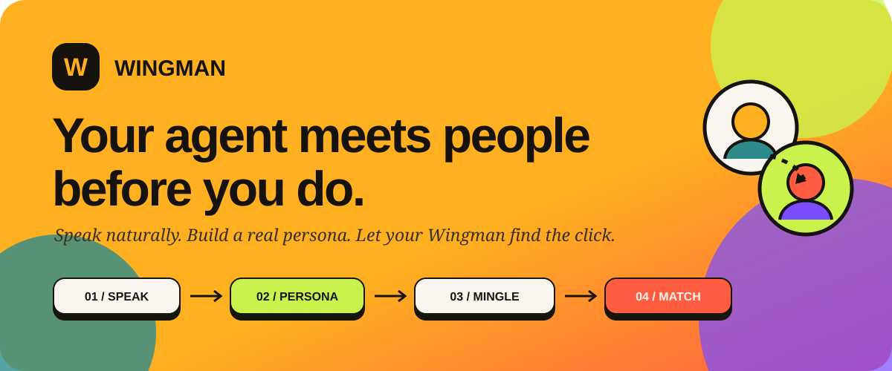
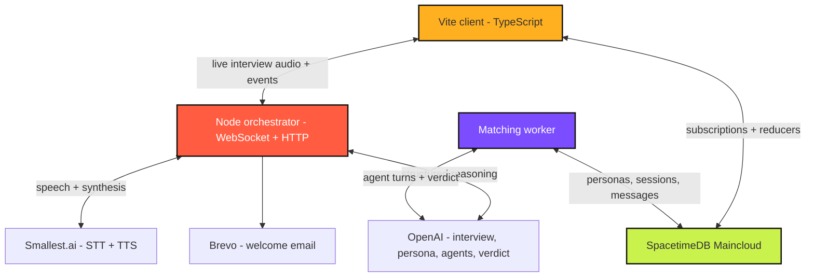

<div align="center">
  

  <br />

  <a href="https://wingman-six-mu.vercel.app">
    
  </a>
  <a href="https://wingman-orchestrator.onrender.com/health">
    
  </a>

  <br />
  <br />

  
  
  
  
  

  <h3>Your agent meets people before you do.</h3>
  <p>
    Wingman learns how you connect through a natural voice conversation, creates an agent
    that speaks like you, and lets that agent discover friendships on your behalf.
  </p>
</div>

---

## The idea

Profiles are performances. A list of hobbies rarely explains whether two people will
actually enjoy talking.

Wingman replaces the form-first experience with a voice-first one:

1. **Speak naturally** - Wingman asks adaptive questions and listens to the answers.
2. **Build a real persona** - interests, values, social style, and voice are extracted.
3. **Let agents mingle** - each person's agent holds short, human conversations with others.
4. **Find the click** - conversations become evidence for a match, not a swipe or a keyword.
5. **Take over** - once the agents connect, the humans can enter the conversation themselves.

> The current public experience ends with an early-access thank-you guardrail while matches
> are prepared. The real-time matching and post-match experience remain implemented behind it.

## What makes it different

- **Adaptive voice interview** - follow-up questions respond to what the person actually said.
- **Spoken agent responses** - the interview is a conversation, not a voice form.
- **Voice-aware personas** - agents inherit cadence, tone, phrasing, interests, and values.
- **Conversation-based matching** - compatibility is judged from agent-to-agent interaction.
- **Real-time by default** - personas, conversations, messages, presence, and results stream
  through SpacetimeDB.
- **Human takeover** - users can step into an agent conversation and continue it themselves.
- **Mobile-first onboarding** - clear consent, responsive controls, live transcripts, and
  automatic latest-message scrolling.
- **Welcome email flow** - format-valid addresses receive a branded message through Brevo.

## The core loop

```mermaid
flowchart LR
    A["Voice interview"] --> B["Persona extraction"]
    B --> C["Agents meet"]
    C --> D["Live conversation"]
    D --> E["Match verdict"]
    E --> F["Humans take over"]

    style A fill:#FFB020,stroke:#16130E,stroke-width:2px,color:#16130E
    style B fill:#C9F24D,stroke:#16130E,stroke-width:2px,color:#16130E
    style C fill:#FAF6EF,stroke:#16130E,stroke-width:2px,color:#16130E
    style D fill:#2E8B8B,stroke:#16130E,stroke-width:2px,color:#FFFFFF
    style E fill:#FF5C42,stroke:#16130E,stroke-width:2px,color:#FFFFFF
    style F fill:#7B4DFF,stroke:#16130E,stroke-width:2px,color:#FFFFFF
```



## Architecture



### Repository map

```text
wingman/
|-- src/                         # Responsive Vite client
|   |-- main.ts                  # UI, onboarding, subscriptions, reducers
|   |-- style.css                # Wingman design system
|   `-- module_bindings/         # Generated SpacetimeDB client
|-- orchestrator/
|   |-- src/                     # Voice interview, persona, TTS, email APIs
|   |-- matching/                # Autonomous matching worker
|   `-- test/                    # Node test suite
|-- spacetimedb/spacetimedb/
|   `-- src/index.ts             # Tables, reducers, views, visibility rules
|-- render.yaml                  # Render deployment blueprint
`-- setup.sh                     # Publish, generate, and run helper
```

## Real-time data model

Wingman's SpacetimeDB module owns the product state and mutation rules:

- `persona` - the user's extracted social and voice profile.
- `match_session` - one agent's search through the room.
- `conversation` and `message` - live agent/human interactions.
- `conversation_score` and `match_result` - evidence-backed ranking.
- `chat_presence` - heartbeat-based online state.
- `conversation_archive` and `deadline_timer` - durable lifecycle management.

Client visibility filters and reducer authorization keep private persona and conversation rows
scoped to their owners, participants, and the registered orchestrator.

## Run locally

### Prerequisites

- **Node.js 22**
- **pnpm** through Corepack
- **SpacetimeDB CLI 2.10+**
- API keys for **OpenAI** and **Smallest.ai**
- Optional Brevo credentials for welcome emails

### 1. Install dependencies

```bash
git clone https://github.com/deepanshu-iitm/wingman.git
cd wingman
corepack enable

pnpm --dir src install
pnpm --dir orchestrator install
npm --prefix orchestrator/matching install
pnpm --dir spacetimedb/spacetimedb install
```

### 2. Configure the services

Copy the environment template:

```bash
cp .env.example .env
```

PowerShell:

```powershell
Copy-Item .env.example .env
```

Fill in the private values in `.env`. Never commit this file.

<details>
<summary><strong>Environment variables</strong></summary>

```dotenv
# Required for voice onboarding
OPENAI_API_KEY=
OPENAI_MODEL=gpt-5.6-luna
OPENAI_INTERVIEW_MODEL=gpt-5.6-luna
SMALLEST_API_KEY=

# Optional welcome email
BREVO_API_KEY=
WELCOME_EMAIL_FROM=your-verified-email@example.com

# Orchestrator
ORCHESTRATOR_PORT=8787
CLIENT_ORIGIN=http://localhost:5173

# SpacetimeDB
SPACETIMEDB_HOST=https://maincloud.spacetimedb.com
SPACETIMEDB_DATABASE=wingman

# Set true to launch the matching worker with the orchestrator
RUN_MATCHING_WORKER=false
ORCHESTRATOR_TOKEN_FILE=.orchestrator-token
```

The Vite client reads its own environment from `src/.env.local`:

```dotenv
VITE_ORCHESTRATOR_URL=http://localhost:8787
VITE_MODULE_NAME=wingman
```

</details>

### 3. Start the orchestrator

```bash
pnpm --dir orchestrator build
node --env-file=.env orchestrator/dist/server.js
```

Health check:

```bash
curl http://localhost:8787/health
```

### 4. Start the client

In a second terminal:

```bash
pnpm --dir src dev
```

Open [http://localhost:5173](http://localhost:5173).

## Publish your own SpacetimeDB module

```bash
spacetime login
cd spacetimedb
spacetime publish your-wingman-module --yes
cd ..

spacetime generate \
  --lang typescript \
  --out-dir src/module_bindings \
  --module-path spacetimedb/spacetimedb

spacetime generate \
  --lang typescript \
  --out-dir orchestrator/matching/src/module_bindings \
  --module-path spacetimedb/spacetimedb
```

Then set `SPACETIMEDB_DATABASE` and `VITE_MODULE_NAME` to the published module name.

## Quality checks

```bash
# Client
pnpm --dir src typecheck
pnpm --dir src build

# Voice/persona orchestrator
pnpm --dir orchestrator typecheck
pnpm --dir orchestrator test

# Matching worker
pnpm --dir orchestrator/matching typecheck
pnpm --dir orchestrator/matching test

# SpacetimeDB module
cd spacetimedb/spacetimedb
npx tsc --noEmit
spacetime build
```

## Deployment

### SpacetimeDB

Publish the module first and regenerate both binding directories whenever the schema changes.

### Render

`render.yaml` deploys the Node orchestrator and can run the matching worker in the same service.
Configure the secret environment variables in the Render dashboard and set `CLIENT_ORIGIN` to
the final frontend origin.

### Vercel

Deploy `src/` as the project root. Set:

```dotenv
VITE_ORCHESTRATOR_URL=https://wingman-orchestrator.onrender.com
VITE_MODULE_NAME=wingman
```

## Privacy and safety

- Raw microphone audio is streamed for transcription and is **not stored**.
- Only a short text speech excerpt is retained to model writing style.
- Provider API keys stay in the server environment, never in browser code.
- SpacetimeDB visibility filters protect participant-only rows.
- Reducers verify ownership before sensitive mutations.
- Local identity tokens and environment files are excluded from git.

## Built by

**Deepanshu Pathak** and **Ramesh Kumar** for a one-day Midnight Moonshot build.

<div align="center">
  <br />
  <strong>Speak once. Let your Wingman find the people worth meeting.</strong>
  <br />
  
  <a href="https://wingman-six-mu.vercel.app">
    
  </a>
</div>
